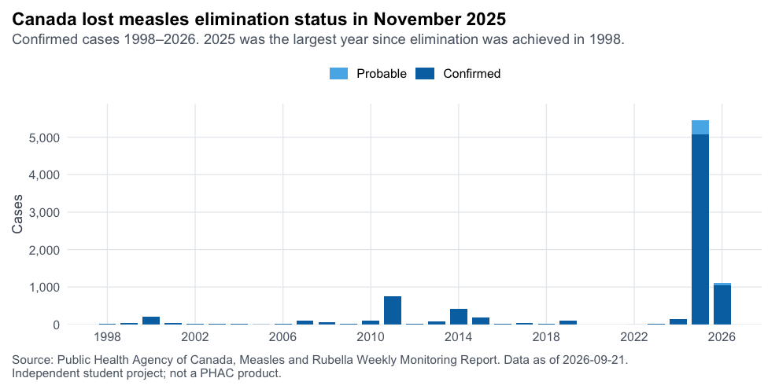
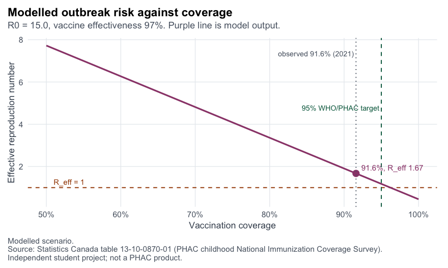
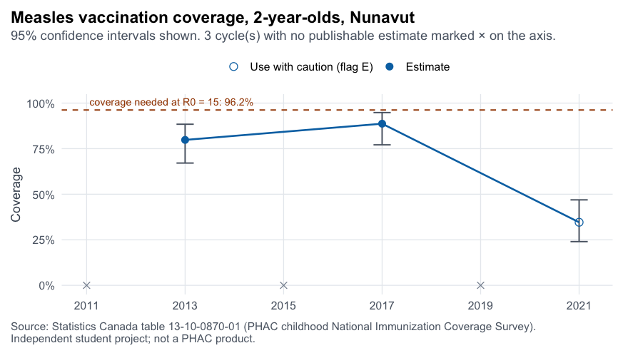

# MECS — Measles Elimination and Coverage Simulator

An interactive R Shiny dashboard showing how measles vaccination coverage relates to outbreak risk, and
tracking Canada's path back to measles elimination status after it was lost in November 2025.

Built for federal and provincial public health analysts, epidemiologists and immunization program
managers.

**Source:** https://github.com/irtusak/measles-mecs
**Live demo:** _add your shinyapps.io URL here after the first deploy_
**Contact:** Kasturi Rangarajan — kasturi_rangarajan@sfu.ca

An independent student project by Kasturi Rangarajan, Master of Public Health candidate, Simon Fraser
University. It uses open data from the Public Health Agency of Canada and Statistics Canada. **It is not
produced or endorsed by PHAC, Statistics Canada, or any province or territory.**

---

## If you have five minutes

1. **Simulator tab** — move the coverage slider and watch the effective reproduction number cross 1. The
   dashed green line is the 95% target; the accordion below shows where that number comes from.
2. **Surveillance tab** — the *Reporting lag* and *Data suppression* boxes say what the curves cannot.
3. **Methods & data tab** — every parameter, its source, and what is observed versus modelled.
4. [`CLAUDE.md`](CLAUDE.md) — the decision log, including the six bugs the test suites caught during the build.

| | |
|---|---|
|  |  |



*Example renders from the 21 September 2026 data. The live dashboard redraws them from current data.*

## What it does

A masthead carries the title, a short description of the tool and Kasturi's contact details above the
tabs, so they are on screen whichever tab is open. Detail that is not needed at a glance sits in collapsed
panels rather than on the page.

| Tab | What it shows |
|---|---|
| **Overview** | Current situation, the annual epidemic curve since 1998, who is being infected, and a live count of progress through the 12-month interruption requirement |
| **Surveillance** | Weekly epidemic curves by province for the current reporting year, and year-to-date cases by jurisdiction |
| **Simulator** | Move coverage, R₀ and vaccine effectiveness and watch the effective reproduction number, expected outbreak size and the derivation of the 95% target respond |
| **Equity lens** | Why a province can report coverage above target and still sustain transmission in an under-immunized community |
| **Policy brief** | A plain-language evidence-informed brief with recommendations |
| **Methods & data** | Every parameter, assumption and limitation |

## Running it

Requires R 4.x.

```bash
Rscript -e 'install.packages(c("shiny","bslib","ggplot2","dplyr","tidyr","readr","jsonlite","markdown","scales"))'

Rscript scripts/fetch_data.R      # download raw PHAC + StatCan sources
Rscript scripts/prepare_data.R    # parse into data/tidy/
Rscript scripts/render_brief.R    # fill the policy brief's figures from the tidy data
Rscript -e 'shiny::runApp("app.R", port = 7788)'
```

Then open http://127.0.0.1:7788.

The tidy data is committed, so the app runs without the fetch step. Re-run fetch and prepare to update to
the latest PHAC report.

> On macOS, if `install.packages()` fails with *"Can't initialize filter; unable to run program zstd"*,
> prefix it with `TAR=internal`.

## Tests

```bash
Rscript tests/test_model.R    # the transmission model, against hand-computed values
Rscript tests/test_plots.R    # renders every chart headlessly to tests/output/
Rscript tests/test_server.R   # the Shiny server, every jurisdiction and slider edge
Rscript tests/test_resume_claims.R   # every CV claim, checked against the app
Rscript tests/test_contrast.R        # WCAG AA contrast on every colour pair
```

The model tests check the epidemiology against hand-computed values, including validating the
epidemiological-week function against PHAC's own published week dates. The plot tests render every chart
against the real data, so a broken chart is caught without opening a browser. The server tests drive the
reactive logic with `shiny::testServer` across every jurisdiction, age group and slider edge. The resume
claims test asserts that each statement made about this project on a CV is actually true of the app — that
the surveillance tab really does carry historical and recent curves with reporting-lag and suppression
caveats, that the brief really does explain the 12-month requirement, and so on.

## How it is organised

```
app.R                    the Shiny application
R/model.R                transmission model — pure, testable, no Shiny
R/plots.R                chart builders — pure functions returning ggplot objects
R/theme.R                shared theme and the Okabe–Ito colour-blind-safe palette
scripts/fetch_data.R     downloads raw sources, writes data/raw/manifest.json
scripts/prepare_data.R   parses raw sources into data/tidy/
data/SOURCES.md          every URL, what it contains, and its licence
docs/METHODS.md          methods, parameters, assumptions and limitations
docs/policy_brief.tmpl.md the brief, with {{placeholders}} for every data-derived figure
docs/policy_brief.md     the rendered brief (generated by scripts/render_brief.R; do not edit)
scripts/render_brief.R   fills the template from data/tidy/
docs/DEPLOY.md           how to publish to GitHub and shinyapps.io
tests/                   model assertions and headless chart rendering
CLAUDE.md                project rules and the running decision log
```

The pipeline lives in `scripts/`, not `R/`, because Shiny automatically sources every `.R` file in an app's
`R/` directory at startup — which would re-download from PHAC every time the app launched.

## Data and licences

- Contains information licensed under the Open Government Licence – Canada: Public Health Agency of
  Canada, *Measles and Rubella Weekly Monitoring Report*.
- Adapted from Statistics Canada, table 13-10-0870-01 *Vaccine coverage estimates for recommended vaccines
  in children and pregnant women* (childhood National Immunization Coverage Survey), 2021 cycle. This does
  not constitute an endorsement by Statistics Canada of this product.

See [`data/SOURCES.md`](data/SOURCES.md) for the full list, including known limitations of each source.

## Staying current

PHAC publishes the monitoring report weekly. A scheduled GitHub Action
([`.github/workflows/update-data.yml`](.github/workflows/update-data.yml)) runs every Tuesday: it downloads
the latest PHAC and Statistics Canada files, reparses them, runs all five test suites, and commits and
redeploys **only if everything passes**. If PHAC changes a file format, the workflow fails and emails
Kasturi while the deployed dashboard carries on serving the last known-good data.

The app itself makes one small runtime request: it reads PHAC's 19-byte `updateDate.csv` to tell the reader
whether a newer report exists, and says so in the masthead. It downloads no data files, and any failure of
that check is silent.

Deploying from the Action needs three repository secrets — `SHINYAPPS_NAME`, `SHINYAPPS_TOKEN` and
`SHINYAPPS_SECRET`. Without them the workflow still refreshes the repository; it just does not redeploy.

## Publishing

See [`docs/DEPLOY.md`](docs/DEPLOY.md). The deployment bundle has been pre-flighted: 29 files, 2.7 MB, with
all nine packages detected by `rsconnect`.

## Two things worth knowing before you read the numbers

**Suppressed data stays suppressed.** Statistics Canada quality flags are carried through to the interface:
`E` estimates are shown with a caution marker and their confidence interval, while `F`, `x` and `..` are
shown as gaps and never as numbers. Survey cycles with no publishable estimate appear as crosses on the
axis rather than being joined across.

**Modelled is labelled.** The simulator and the clustering lens produce modelled values, and say so on
every view. No modelled number is ever drawn on a surveillance chart.

**Readable by measurement, not by eye.** Every text colour clears the WCAG AA 4.5:1 contrast minimum
against the surface it sits on, and `tests/test_contrast.R` computes the ratios and fails if one drops
below. Charts use the colour-blind-safe Okabe-Ito palette, and reference lines are drawn in the same colour
as their own labels so each pair reads as one thing.
